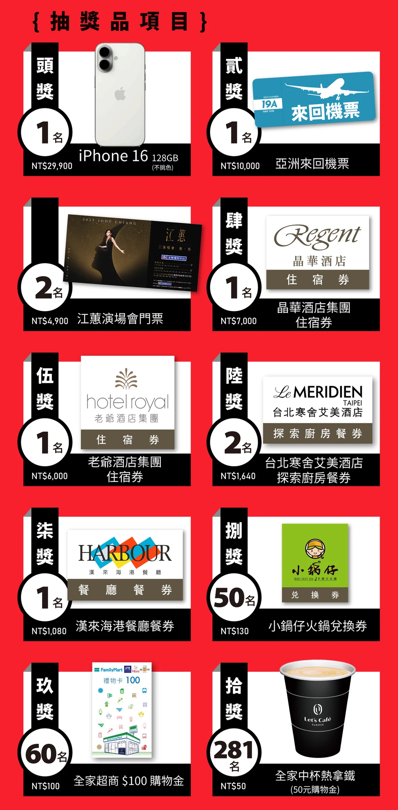
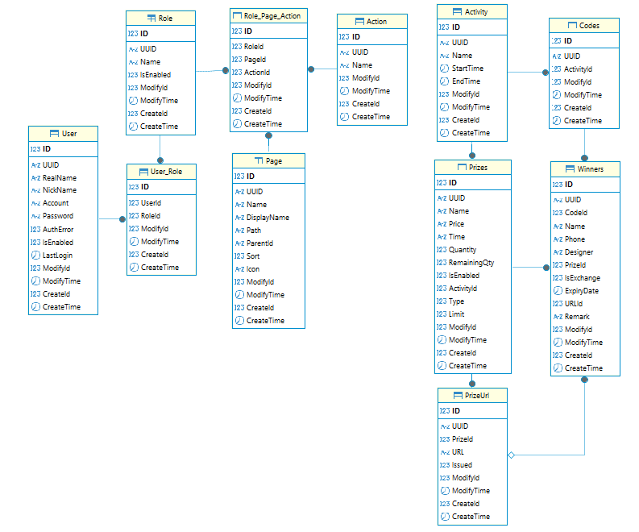

# Haife Luckybag

## Info




## Infrastructure

```
- Engine: Azure VM
- OS: Ubuntu 22.04
- Size: Standard B2s (2 vcpu，4 GiB Ram)
- Location: Southeast Asia
- Host: haifesalon.southeastasia.cloudapp.azure.com
- Database: Microsoft SQL Server 2022
- Frontend: Vue 3 + Vite + Tailwind CSS
- Backend: Node.js + Express
```

## Database Schema



## Copyright

Copyright © 2025 Haife Salon All rights reserved.  
Develop by [Samuel Chi](https://samuelchi861008.github.io/)
